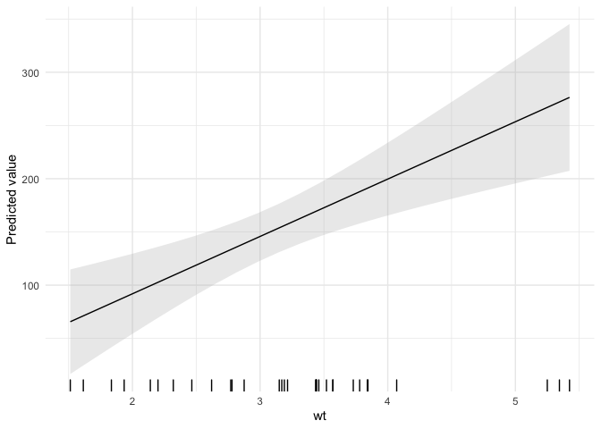
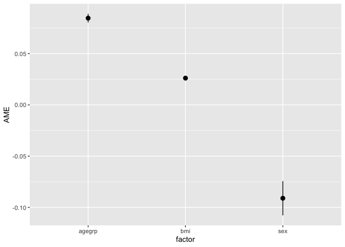
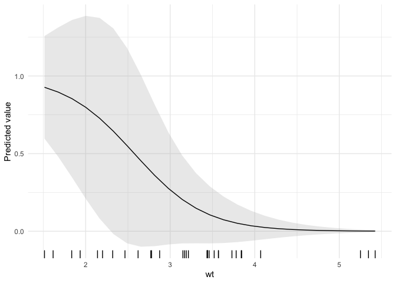
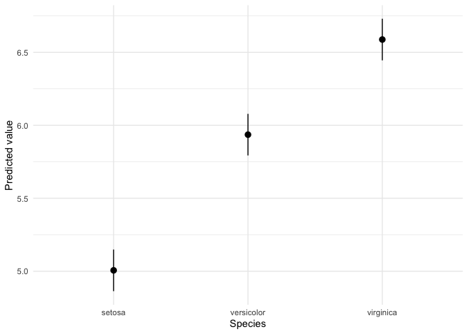
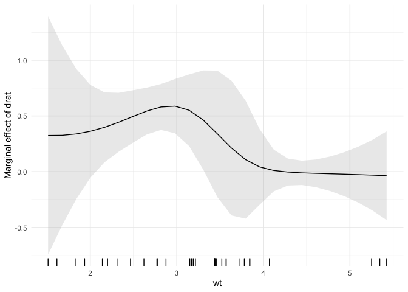
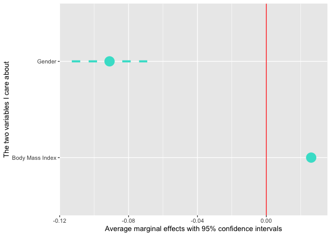
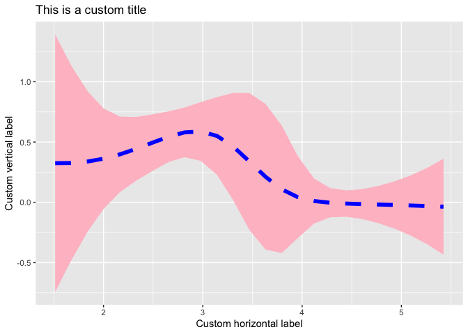

Marginal effects visualization with ggplot2
================

This package overrides plotting functions from the `margins` `R` package
in order to produce `ggplot2` objects. This makes it much easier for
users to customize the look of their marginal effects and predicted
probabilities plots.

To install this package, execute the following commands:

``` r
library(remotes)
install_github('vincentarelbundock/marginsplot')
```

To use the package, you need to load `marginsplot` **after** `margins`,
to ensure that the new plotting functions take precedence. For example:

``` r
library(margins)
library(marginsplot)
```

    ## Loading required package: ggplot2

    ## Registered S3 method overwritten by 'marginsplot':
    ##   method       from   
    ##   plot.margins margins

    ## 
    ## Attaching package: 'marginsplot'

    ## The following object is masked from 'package:margins':
    ## 
    ##     cplot

``` r
mod <- lm(hp ~ wt*drat, data = mtcars)
cplot(mod, dx = 'drat', x = 'wt')
```

<!-- -->

Alternatively, you could explicitly prioritize `marginsplot` using the
`conflicted` package:

``` r
library(conflicted)
conflict_prefer('cplot', 'marginsplot')
```

    ## [conflicted] Will prefer marginsplot::cplot over any other package

``` r
conflict_prefer('plot', 'marginsplot')
```

    ## [conflicted] Will prefer marginsplot::plot over any other package

The next section is a modified version of the `margins` README, which
shows how to customize the output of `marginsplot`.

# Modified `margins` README

## Visualization

The package implements several useful additional features for
summarizing model objects, including:

  - A `plot()` method for the new “margins” class that ports Stata’s
    `marginsplot` command.
  - A plotting function `cplot()` to provide the commonly needed visual
    summaries of predictions or average marginal effects conditional on
    a covariate.
  - A `persp()` method for “lm”, “glm”, and “loess” objects to provide
    three-dimensional representations of response surfaces or marginal
    effects over two covariates.
  - An `image()` method for the same that produces flat, two-dimensional
    heatmap-style representations of `persp()`-type plots.

`plot()` and `cplot()` return `ggplot2` objects, which can be further
customized using themes and other `ggplot2` options.

### Marginal effects plots

Using the `plot()` method yields an aesthetically similar result to
Stata’s `marginsplot`:

``` r
library("webuse")
webuse::webuse("nhanes2")
mod3 <- glm(highbp ~ sex * agegrp * bmi, data = nhanes2, family = binomial)
summary(marg3 <- margins(mod3))
```

    ##  factor     AME     SE        z      p   lower   upper
    ##  agegrp  0.0846 0.0021  39.4392 0.0000  0.0804  0.0888
    ##     bmi  0.0261 0.0009  28.4995 0.0000  0.0243  0.0279
    ##     sex -0.0911 0.0085 -10.7064 0.0000 -0.1077 -0.0744

``` r
plot(marg3)
```

<!-- -->

### Conditional effects plots

In addition to the estimation procedures and `plot()` generic,
**margins** offers several plotting methods for model objects. First,
there is a new generic `cplot()` that displays predictions or marginal
effects (from an “lm” or “glm” model) of a variable conditional across
values of third variable (or itself). For example, here is a graph of
predicted probabilities from a logit model:

``` r
mod4 <- glm(am ~ wt*drat, data = mtcars, family = binomial)
cplot(mod4, x = "wt", dx = 'drat')
```

<!-- -->

And fitted values with a factor independent variable:

``` r
cplot(lm(Sepal.Length ~ Species, data = iris))
```

<!-- -->

and a graph of the effect of `drat` across levels of `wt`:

``` r
cplot(mod4, x = "wt", dx = "drat", what = "effect")
```

<!-- -->

### Customizing the look of your plots

Since `cplot()` and `plot()` return `ggplot2` objects, the look is very
easy to customize. For example, we could flip the marginal effects plot
on its side, change the colors and line type, rename the variables, and
add a red line at 0:

``` r
library(ggplot2)
mod3 <- glm(highbp ~ sex * agegrp * bmi, data = nhanes2, family = binomial)
marg3 <- margins(mod3)
plot(marg3,
     level = .99,
     colour = 'turquoise', size = 1.5, linetype = 'dashed',
     term_map = c('Body Mass Index' = 'bmi','Gender' = 'sex')) + 
  geom_hline(yintercept = 0, colour = 'red') +
  xlab('The two variables I care about') +
  ylab('Average marginal effects with 95% confidence intervals') +
  coord_flip()
```

<!-- -->

Notice that the `agegrp` does not appear in the plot above because it
was omitted from the `term_map` argument. This gives you a convenient
way to omit terms from the plot.

We can apply the same kinds of changes to graphs produced by `cplot()`:

``` r
library(ggplot2)
cplot(mod4, x = "wt", dx = 'drat', what='effect', size=2, colour='blue', 
      fill = 'pink', alpha=1, linetype='dashed', rugplot=FALSE) + 
    theme_grey() +
    xlab('Custom horizontal label') +
    ylab('Custom vertical label') +
    ggtitle('This is a custom title')
```

<!-- -->

You can even use one of many user-created themes that are floating
around the web. For instance, here is a plot drawn with the
[`ggpomological theme`](https://github.com/gadenbuie/ggpomological) and
the [Homemade Apple
font](https://fonts.google.com/specimen/Homemade+Apple/):

``` r
library(ggpomological)
cplot(mod4, x = "wt", dx = 'drat', what='effect', alpha=.5, fill='#efe1c6', colour='#6f5438') + 
    theme_pomological_fancy()
```

If you would like even more control over your plots, `cplot()` can also
return a data frame of quantities of interest:

``` r
dat <- cplot(mod4, x = "wt", dx = "drat", what = "effect", draw = FALSE)
head(dat)
```

    ##   xvals  yvals  upper   lower factor
    ##  1.5130 0.3250 1.3927 -0.7426   drat
    ##  1.6760 0.3262 1.1318 -0.4795   drat
    ##  1.8389 0.3384 0.9214 -0.2447   drat
    ##  2.0019 0.3623 0.7777 -0.0531   drat
    ##  2.1648 0.3978 0.7110  0.0846   drat
    ##  2.3278 0.4432 0.7074  0.1789   drat
